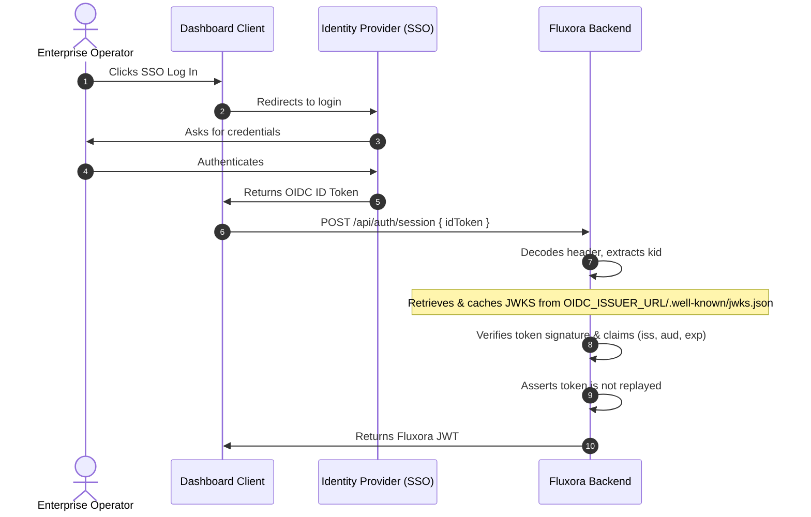

# Authentication & Authorization (RBAC)

This document describes the fine-grained permission model introduced to replace simple `role` checks.

JWT claim structure
- `address` (string): account address
- `role` (string): convenience hint (e.g. `operator`, `viewer`, `admin`)
- `permissions` (string[]): explicit permission scopes such as `streams:read` or `admin:pause`

Permission enum (representative)
- `streams:read`, `streams:write`
- `admin:pause`, `admin:reindex`, `indexer:replay`
- `dlq:list`, `dlq:read`, `dlq:replay`, `dlq:delete`
- `audit:read`, `audit:write`

Roles and default permissions
- `operator`: elevated operational permissions (streams read/write, DLQ, basic audit read)
- `viewer`: read-only (`streams:read`)
- `admin`: all permissions

Middleware
- `authenticate`: verifies JWT and validates payload with Zod (must include `permissions` array).
- `requireAuth`: ensures an authenticated user exists.
- `requirePermission(permission)`: middleware factory that ensures the caller holds the requested permission.

Notes
- Tokens without a `permissions` claim are rejected by `authenticate`.
- For backward compatibility in tests and local token generation, `generateToken()` will backfill sensible permissions based on `role` if `permissions` is not supplied.
# Authentication and Pluggable OIDC Support

Fluxora supports two parallel authentication paths at the session creation endpoint `POST /api/auth/session` to obtain a Fluxora JWT:

1. **Shared-Secret Authentication (Fallback):** Generates a JWT using a static pre-configured secret.
2. **Pluggable OIDC/OAuth2 Authentication:** Exchanges an ID token from an external Identity Provider (SSO) for a Fluxora JWT.

---

## Configuration

To enable OIDC/OAuth2 authentication, configure the following environment variables:

| Environment Variable | Type | Required | Description |
| :--- | :--- | :--- | :--- |
| `OIDC_ISSUER_URL` | URL | No | The base URL of the identity provider (e.g. `https://keycloak.example.com/realms/myrealm` or `https://auth0.com`). If set, OIDC authentication is enabled. |
| `OIDC_AUDIENCE` | String | No | The client ID / audience expected in incoming ID tokens. Signature claims validation will enforce this check if set. |

---

## Flow: OIDC ID Token Exchange

Enterprise dashboard clients or operators can exchange their OIDC ID Token for a Fluxora JWT.



### Request Example
```http
POST /api/auth/session
Content-Type: application/json

{
  "idToken": "eyJhbGciOiJSUzI1NiIsImtpZCI6ImtleS1pZC0xIi... "
}
```

### Response Example
```json
{
  "token": "eyJhbGciOiJIUzI1NiIsInR5cCI6IkpXVCJ9...",
  "user": {
    "address": "GCSX22222222222222222222222222222222222222222222222222UV",
    "role": "operator"
  }
}
```

---

## Security & Implementation Details

- **JWKS Cache Policy:** The JWKS retrieved from the provider is cached in Redis (under the key `fluxora:jwks:<issuer_url>`) and locally in memory for 24 hours to reduce latency.
- **Key Rotation Support:** If a token contains a `kid` that is not found in the cache, Fluxora will automatically perform a force refresh once to fetch fresh keys from the provider.
- **Token Replay Prevention:** Verified ID tokens are hashed via SHA-256 and registered in Redis (and memory) with a TTL matching the token's expiration (`exp`). If a duplicate token is presented during this period, it is rejected with an unauthorized error.
- **Address Claims Mapping:** To map the SSO identity to a Stellar account address, Fluxora parses claims in the following order of precedence:
  1. `stellar_address`
  2. `address`
  3. `sub`
